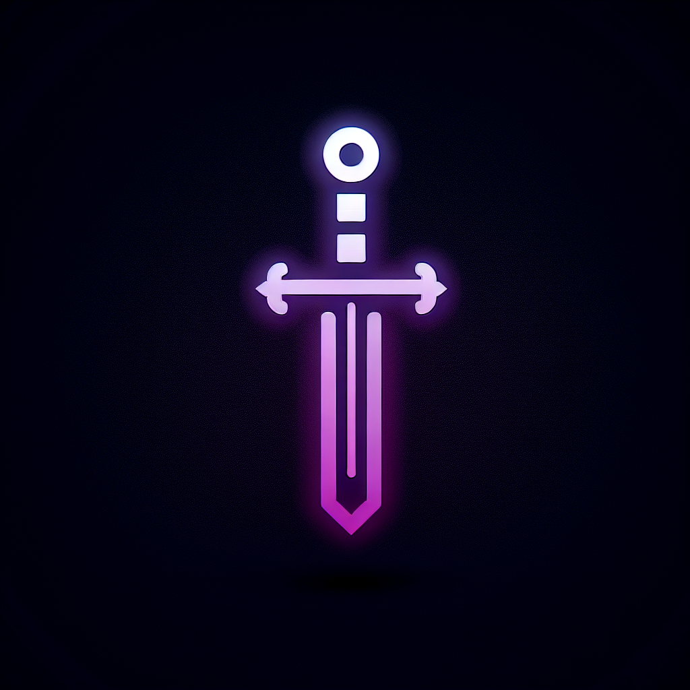

# DevQuest Portfolio 🏰✨

<div align="center">
  
  <h3>A medieval-themed interactive developer portfolio</h3>
  <a href="https://christopherjoshy.github.io/ProtfolioG/" target="_blank">🔮 Live Demo</a>
</div>

<br />

<div align="center">


</div>

## ✨ Features

<details>
<summary><b>🏰 Medieval RPG Theme</b></summary>

<p align="center">

</p>

- Immersive medieval fantasy user interface
- Pixel art graphics and animations
- RPG-style navigation between sections
- Magical visual effects and transitions
</details>

<details>
<summary><b>⚔️ Interactive Zones</b></summary>

<p align="center">

</p>

- Unique themed areas for different content:
  - 🏠 Home Village (Introduction)
  - 🎓 Education Guild Hall
  - 🛡️ Skills Armory
  - 🔮 Projects Forge
  - 📜 Quests Board
  - 📬 Contact Tavern
</details>

<details>
<summary><b>🎮 Gamified Experience</b></summary>

<p align="center">

</p>

- Level-up system representing career progression
- Skill trees with visual progression indicators
- Achievement system for professional milestones
- Interactive elements and Easter eggs
</details>

<details>
<summary><b>🌓 Dynamic Themes</b></summary>

<p align="center">

</p>

- Light theme: Daytime medieval village 
- Dark theme: Nighttime enchanted realm
- Smooth transitions between themes
- Theme-specific animations and effects
</details>

<details>
<summary><b>🎵 Atmospheric Soundtrack</b></summary>

<p align="center">

</p>

- Medieval background music enhancing immersion
- Toggle-able music system for user preference
- Consistent audio experience across all sections
</details>

<details>
<summary><b>🖼️ Project Showcase</b></summary>

<p align="center">

</p>

- Interactive project cards with detailed information
- Medieval-themed project illustrations
- Magical animations on project interaction
- Direct links to live demos and repositories
</details>

<details>
<summary><b>📱 Responsive Design</b></summary>

<p align="center">

</p>

- Fully responsive across all devices
- Mobile-optimized navigation 
- Touch-friendly interactive elements
- Consistent experience on all screen sizes
</details>

<details>
<summary><b>🌟 Visual Effects</b></summary>

<p align="center">

</p>

- Custom cursor with trail effects
- Parallax scrolling backgrounds
- Magic spell animations for interactions 
- Ambient particle effects
</details>

## 🚀 Technologies Used

- **Frontend**: React, TypeScript, Tailwind CSS
- **Animation**: Framer Motion, Custom CSS Animations
- **State Management**: Zustand
- **Deployment**: GitHub Pages
- **Media**: SVG Graphics, Custom Audio

## 🛠️ Installation & Setup

```bash
# Clone the repository
git clone https://github.com/yourusername/your-portfolio.git

# Navigate to project directory
cd your-portfolio

# Install dependencies
npm install

# Start development server
npm run dev

# Build for production
npm run build

# Deploy to GitHub Pages
npm run deploy
```

## 📄 License

This project is licensed under the MIT License - see the LICENSE file for details.

## 📬 Contact

Feel free to reach out if you have questions or just want to connect!

- GitHub: [@ChristopherJoshy](https://github.com/ChristopherJoshy)
- Website: [Portfolio](https://christopherjoshy.github.io/ProtfolioG/)

---

<p align="center">Made with ⚔️ and 💻</p> 